# duet

**Claude Code, Codex, Antigravity CLI를 한 팀으로 묶는 로컬 멀티 에이전트 개발 오케스트레이터**

설계자 에이전트와 대화하면, 설계자가 요구를 설계로 바꾸고 구현자·디자이너·리서처 세션에 일을 나눠 맡긴 뒤 결과를 검토하며 개발을 이어갑니다.
각 에이전트는 이미 설치·로그인된 CLI를 그대로 실행하므로 구독, 설정, `CLAUDE.md`/`AGENTS.md`, MCP, 스킬, 세션 기억이 모두 그대로 쓰입니다. API를 직접 호출하지 않습니다.

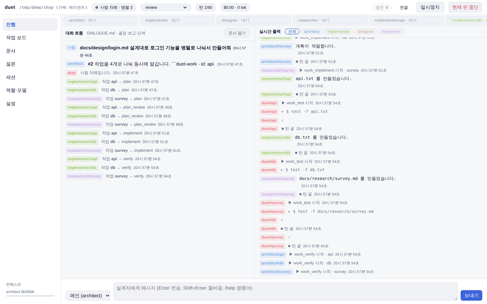

> 이 문서의 화면은 `--fake`(CLI 없이 흐름을 시험하는 데모 모드)로 촬영했습니다. 상단의 "가짜 에이전트" 표시는 데모 모드에서만 나타납니다.

## 목차

- [주요 기능](#주요-기능)
- [동작 방식](#동작-방식)
- [요구 사항](#요구-사항)
- [설치와 실행](#설치와-실행)
- [화면 구성](#화면-구성)
- [역할](#역할)
- [합의 기반 위임](#합의-기반-위임)
- [병렬 작업](#병렬-작업)
- [권한과 안전장치](#권한과-안전장치)
- [대화 모드](#대화-모드)
- [긴 세션 관리](#긴-세션-관리)
- [세션 저장과 불러오기](#세션-저장과-불러오기)
- [명령어](#명령어)
- [명령행 옵션](#명령행-옵션)
- [설정 파일](#설정-파일)
- [CLI별 참고 사항](#cli별-참고-사항)
- [문제 해결](#문제-해결)
- [개발](#개발)

## 주요 기능

- **하네스 보존**: Claude Code(Agent SDK), Codex(`codex app-server`), Antigravity(`agy` 헤드리스)를 설치된 그대로 실행합니다. 각 CLI의 로그인·구독·설정·MCP를 그대로 씁니다.
- **역할 기반 협업**: 설계자, 구현자, 디자이너, 리서처 역할을 기본 제공하며, 역할과 모델을 자유롭게 추가·변경할 수 있습니다.
- **합의 후 구현**: 작업자는 먼저 계획(파일 범위, 수용 기준, 테스트 명령)을 제출하고, 설계자가 합의한 뒤에만 코드를 고칩니다. 검증은 합의된 테스트를 실제로 실행해 판단합니다.
- **병렬 작업**: 설계자가 작업을 나누고 역할별 세션 수를 정하면, 각 작업이 독립된 git 워크트리와 로컬 브랜치에서 동시에 진행된 뒤 기준 브랜치로 합쳐집니다.
- **3단계 권한**: 안전한 요청은 자동 허용, 애매한 요청은 설계자 심사, 위험한 요청은 사람 확인. 사람이 모든 권한을 위임하는 전권 자동 모드도 있습니다.
- **웹 UI와 터미널 UI**: 브라우저 대시보드(`--web`)와 분할 화면 TUI 중 골라 씁니다.
- **긴 세션 안정화**: 컨텍스트 한도 감시, 역할별 압축 지침, 작업 기억 파일, 세션 교체와 인계로 깊은 작업을 오래 이어갑니다.
- **세션 저장·복원, git 스냅샷, 롤백**: 대화 시점을 저장하고 되돌아갈 수 있으며, 턴마다 코드 스냅샷을 남깁니다.

## 동작 방식

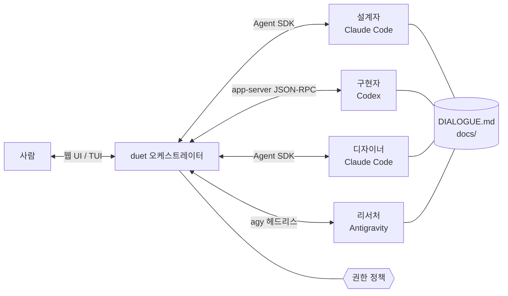

- 에이전트끼리는 프로젝트 루트의 `DIALOGUE.md` 한 문서로 대화합니다. 긴 설계와 계획은 `docs/` 아래 문서로 남깁니다.
- 턴의 흐름은 응답 끝의 HTML 주석 지시문(`<!-- duet: DELEGATE implementer -->` 등)으로 제어합니다.
- 모든 도구 호출과 명령 실행은 duet의 권한 정책을 거칩니다.

## 요구 사항

| 항목 | 내용 |
| --- | --- |
| 운영체제 | macOS, Linux (Windows는 지원 작업 중) |
| Python | 3.10 이상. 없으면 `uv`가 파이썬 3.12를 받아 씁니다 |
| uv | 권장. 의존성 설치가 빠르고 파이썬 버전 문제를 피합니다 (설치 스크립트가 함께 설치) |
| git | 턴 스냅샷, 롤백, 병렬 작업에 필요. 하위 폴더 프로젝트의 병렬 병합은 2.45 이상 |
| CLI | `claude`, `codex`, `agy` 중 쓰려는 것이 설치·로그인되어 있어야 합니다 |
| Node.js | 디자이너의 브라우저 도구(Playwright MCP)를 쓸 때 `npx` 필요 |

CLI 설치 (공식 설치 스크립트, 사용자 권한):

```bash
curl -fsSL https://claude.ai/install.sh | bash               # Claude Code, 설치 후 claude 로 로그인
curl -fsSL https://chatgpt.com/codex/install.sh | sh         # Codex CLI, 설치 후 codex login
curl -fsSL https://antigravity.google/cli/install.sh | bash  # Antigravity CLI, 설치 후 agy 로 로그인
```

설치 여부, PATH, 로그인 상태는 `python3 duet --doctor`가 한 번에 점검합니다.

## 설치와 실행

### 설치 스크립트 (macOS, Linux)

작업할 프로젝트 폴더에서 실행합니다. `./duet`에 내려받고, 필요하면 `uv`를 설치한 뒤 환경을 점검합니다.

```bash
cd ~/my-project
curl -fsSL https://raw.githubusercontent.com/Choo-Wooo/Duet-AI-Operation/main/install.sh | bash
```

이미 `./duet`이 git 클론이면 최신으로 갱신합니다. 환경 변수로 동작을 바꿀 수 있습니다.

| 변수 | 설명 |
| --- | --- |
| `DUET_REF` | 브랜치 또는 태그 (기본 `main`) |
| `DUET_DIR` | 설치 위치 (기본 `./duet`) |
| `DUET_NO_UV=1` | uv를 설치하지 않고 시스템 파이썬만 사용 |
| `DUET_FIX=1` | 점검 뒤 고칠 수 있는 항목을 묻지 않고 고침 |

### 직접 설치

```bash
cd ~/my-project
git clone https://github.com/Choo-Wooo/Duet-AI-Operation.git duet

python3 duet --doctor # 환경 점검
python3 duet --web    # 브라우저 웹 UI (권장)
python3 duet          # 터미널 분할 화면(TUI)
```

### 환경 점검

`python3 duet --doctor`는 가상환경을 만들기 전에 표준 라이브러리만으로 실행되며 다음을 확인합니다.

- 운영체제, root 실행 여부, duet을 돌릴 파이썬(3.10+)과 uv
- git 버전과 전역 사용자 설정, 프로젝트 저장소 상태(커밋, 브랜치)
- Node.js(`npx`) 유무
- `claude`, `codex`, `agy`의 설치 위치, PATH 등록 여부, 버전, 로그인 상태
- `.duet/roles.yaml`의 역할이 설치되지 않은 CLI를 쓰는지
- `.duet/venv` 상태와 PyPI 연결

`--fix`를 붙이면 PATH 등록(셸 설정 파일에 한 줄 추가)과 빠진 CLI·uv 설치를 항목마다 물어보고 실행합니다. `--yes`는 묻지 않고 진행하고, `--no-login`은 로그인 확인을 건너뜁니다. 해결이 필요한 항목이 있으면 종료 코드 1을 돌려줍니다.

처음 실행하면 다음을 자동으로 준비합니다.

1. `.duet/venv` 가상환경과 의존성(claude-agent-sdk, textual, pyyaml, aiohttp). 검증된 버전을 고정한 `requirements.lock`으로 설치하고, 그 플랫폼에서 실패하면 `requirements.txt`의 범위 지정으로 다시 시도합니다. uv가 있으면 uv로 만들고 설치합니다(`DUET_USE_PIP=1`이면 pip). 두 파일 중 하나가 바뀌면 다시 설치합니다.
2. 설치된 CLI를 찾아 `.duet/roles.yaml`을 만듭니다. 여러 곳에 설치된 CLI는 가장 최신 버전을 고릅니다.
3. 각 CLI의 로그인 계정을 확인해 구독인지 API 키 과금인지 알려 줍니다.
4. `.duet/modes.yaml`, `.duet/policy.yaml`, `DIALOGUE.md`를 만듭니다.
5. git 저장소가 아니면 `git init`을 하고, `.gitignore`에 duet 폴더와 런타임 파일을 추가합니다.

`--web`은 이 컴퓨터(127.0.0.1)에서만 열리는 서버를 띄우고, 실행마다 새로 만든 토큰이 붙은 주소를 브라우저로 엽니다. 토큰 없는 요청은 거부합니다. 종료는 터미널에서 `Ctrl+C`입니다.

## 화면 구성

### 웹 UI

상단에는 진행 상태, 대화 모드, 턴 수, 비용·토큰, 승인 대기 수, 일시정지·중단 버튼이 있고, 왼쪽 아래에는 역할별 컨텍스트 사용량이 표시됩니다.

#### 진행

왼쪽은 대화 흐름(사람 메시지, 턴 요약, 지시문, 합의 단계, 승인 기록), 오른쪽은 역할별 실시간 출력(메시지, 도구 호출, 명령 결과)입니다. 위쪽 활동 줄에서 각 역할과 병렬 작업 세션의 현재 상태를 한눈에 봅니다. 아래 입력창에서 받는 대상을 메인, 특정 역할, 병렬 작업 세션 중에서 고를 수 있습니다.

#### 승인 요청

사람 확인이 필요한 요청은 오른쪽 아래 승인 트레이에 카드로 쌓입니다. 요청 내용, 사유, 설계자 의견을 보고 허용, 세션 동안 허용, 거부(사유 입력 가능) 중에서 고릅니다. 여러 요청을 동시에 처리할 수 있습니다.

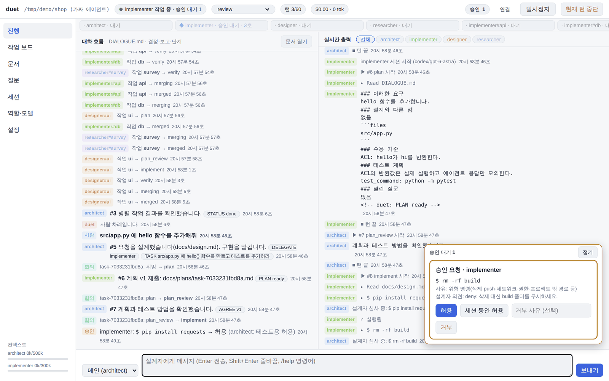

#### 작업 보드

병렬 작업을 대기·진행·완료·중단으로 나눠 보여 줍니다. 각 카드에는 역할, 단계(plan, plan_review, implement, verify, merging, merged), 의존 관계, 합의된 파일, 병합 커밋이 표시되고, 작업 기록 보기·재개·취소를 할 수 있습니다.

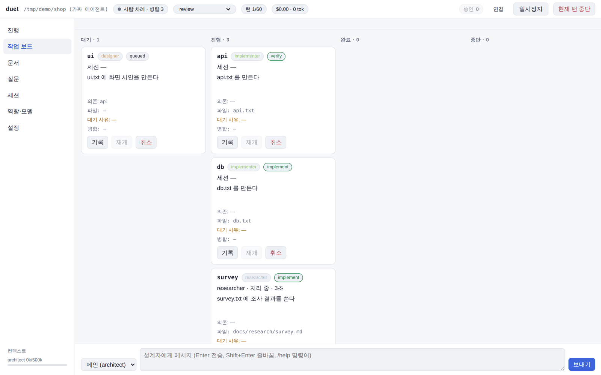

#### 문서

`DIALOGUE.md`, `docs/` 아래 설계·계획·작업 기록·조사 문서를 마크다운으로 렌더링해 보여 줍니다.

- 문서는 폴더별 트리로 정리되며, 폴더마다 문서 수가 표시되고 접고 펼칠 수 있습니다. 처음에는 최상위 폴더만 펼쳐지고, 접힘 상태는 브라우저에 기억됩니다.
- 맨 위 '최근 수정' 묶음에서 최근에 바뀐 문서 8개를 바로 열 수 있습니다.
- 경로 필터에 입력하면 맞는 문서와 그 상위 폴더만 펼쳐 보여 주고, '모두 펼치기'·'모두 접기'로 한 번에 정리할 수 있습니다.
- 목록은 주기적으로 갱신되고, 내용이 바뀐 문서만 다시 그립니다.

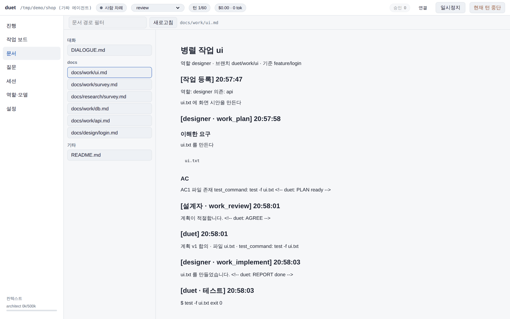

#### 질문

역할 세션을 복제한 읽기 전용 분신에게 프로젝트에 대해 묻습니다. 본 작업 세션의 기억에는 섞이지 않습니다.

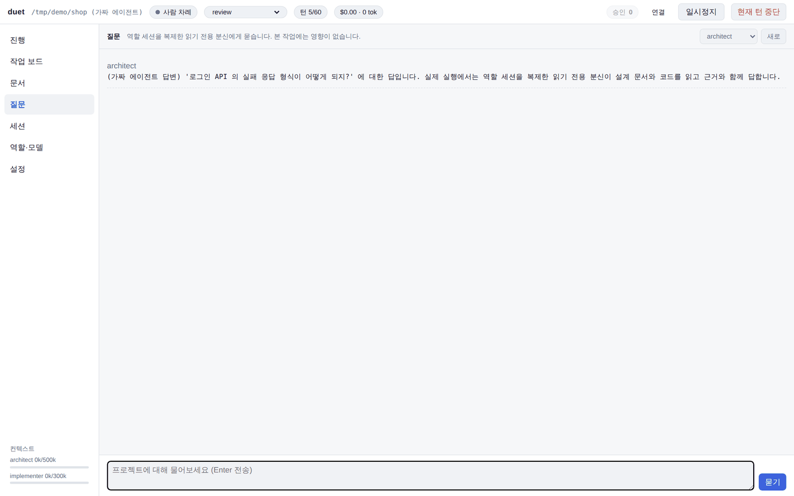

#### 세션

지금 세션을 이름과 메모를 붙여 저장하고, 이전 세션 목록에서 불러오거나 삭제합니다.

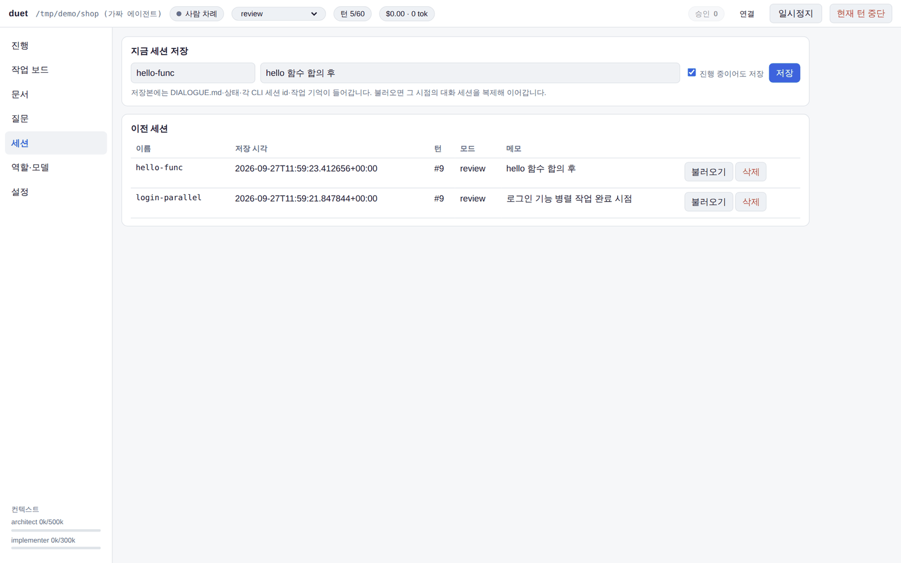

#### 역할·모델

역할의 CLI, 모델, effort, 권한, 병렬 최대 세션 수, 컨텍스트 한도를 바꾸고 역할을 추가·삭제합니다.

- 모델 선택 칸에는 로그인된 모든 CLI(Claude Code, Codex, Antigravity)에서 조회한 모델이 CLI별로 묶여 나옵니다. 다른 CLI의 모델을 고르면 그 역할의 CLI도 함께 바뀝니다.
- 역할 추가에서 프리셋(디자이너, 리서처, 테스터, 코드 리뷰어, 문서 작성자)을 고르면 역할 설명, 권한, 추천 CLI·모델, 병렬 수, 역할 전용 도구가 자동으로 채워집니다.

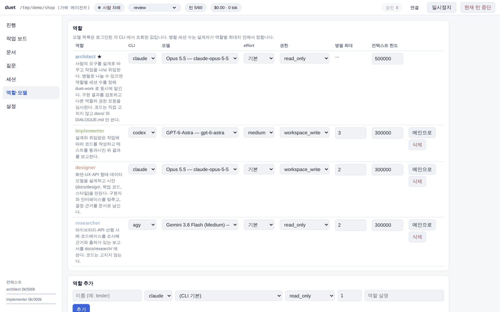

#### 설정

병렬 동시 실행 수, 자동 병합, 통합 테스트 명령, 계획 합의 라운드, 컨텍스트 한도 등 진행 설정을 바꿉니다. 변경 내용은 `.duet/roles.yaml`에 저장됩니다.

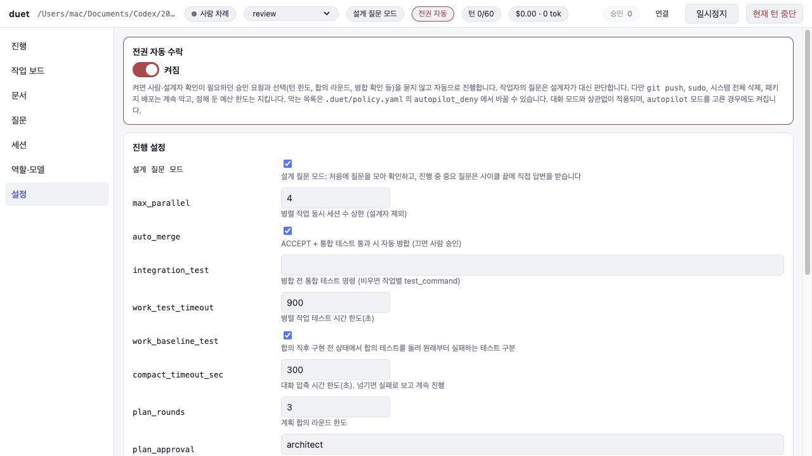

### 터미널 UI

`python3 duet`으로 실행하면 왼쪽에 대화 흐름, 오른쪽에 역할별 탭, 아래에 상태 줄과 입력창이 나옵니다. 승인 팝업에서 `Y` 허용, `A` 세션 동안 허용, `N` 거부를 고릅니다. `Ctrl+X` 현재 턴 중단, `Ctrl+Q` 종료, `Esc` 입력창으로 이동합니다. 단순 콘솔이 필요하면 `--no-tui`를 씁니다.

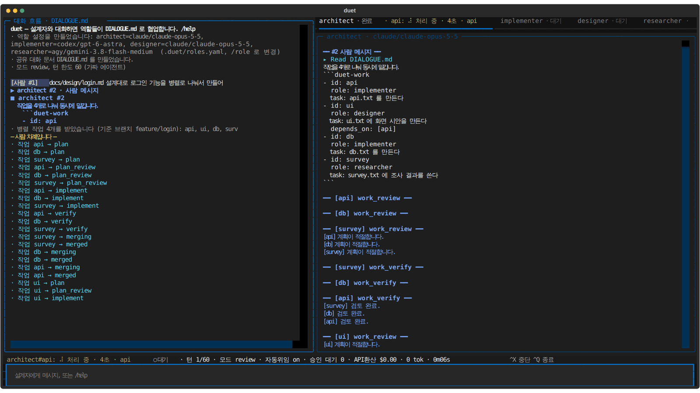

## 역할

처음 실행할 때 설치된 CLI에 맞춰 다음 역할을 만듭니다.

| 역할 | 기본 CLI · 모델 | 권한 | 병렬 최대 | 하는 일 |
| --- | --- | --- | --- | --- |
| architect (메인) | Claude Code · `claude-opus-5-5` | 읽기 전용 (`docs/`, `DIALOGUE.md`만 쓰기) | - | 사람과 대화, 설계, 작업 분할과 위임, 검토, 권한 심사 |
| implementer | Codex · `gpt-6-astra` (effort medium) | 프로젝트 쓰기 | 3 | 합의한 계획대로 구현하고 테스트 통과 |
| designer | Claude Code · `claude-opus-5-5` | 프로젝트 쓰기 | 2 | 화면(UI/UX)·문서·시각 에셋·데이터 시각화 디자인, 렌더링 결과 검증 |
| researcher | Antigravity · `gemini-3.8-flash-medium` | 읽기 전용 (`docs/`만 쓰기) | 2 | 라이브러리·API·선행 사례 조사와 출처가 있는 보고서 |

- 설치되지 않은 CLI의 역할은 다음 선호 CLI로 대체하고, 쓸 수 있는 CLI가 없으면 만들지 않습니다.
- 이전 버전으로 만든 프로젝트에도 디자이너와 리서처가 없으면 다음 실행 때 한 번 추가합니다. 이미 있는 프리셋 이름의 역할은 설명·모델을 그대로 두고 역할 도구만 더합니다. 사람이 지운 역할은 다시 추가하지 않습니다.
- 그 밖의 역할은 웹 UI의 역할 추가 프리셋(테스터, 코드 리뷰어, 문서 작성자 등)이나 `/role add`로 추가합니다.
- 역할별 `mcp`(그 역할 세션에만 붙일 MCP 서버)와 `auto_tools`(자동 허용할 도구 이름 패턴)를 `roles.yaml`에서 바꿀 수 있습니다.
- 설계자가 턴 중에 `PROPOSE_ROLE`로 새 역할을 제안할 수 있으며, 사람이 승인하면 추가됩니다.

### 디자이너

디자이너는 사람이 보고 쓰는 모든 것의 형태를 맡습니다. 설계자는 화면뿐 아니라 문서 구성, 이미지 에셋, 차트가 필요한 작업도 디자이너에게 맡깁니다.

| 분야 | 예 |
| --- | --- |
| 제품 UI/UX | 웹·앱·게임 UI, 화면 흐름, 상호작용, 빈·오류·로딩 상태 |
| 문서 디자인 | README, 설계 문서, 보고서, 가이드, 슬라이드의 구조·제목 위계·표·다이어그램·스크린샷 |
| 시각 에셋 | 색, 타이포그래피, 아이콘, 일러스트, 게임 스킨·텍스처 |
| 데이터 시각화 | 차트 종류, 축·단위·범례, 색 대비 |

작업 절차는 모든 분야에서 같습니다.

1. **먼저 보기**: 기존 스타일(CSS 변수, 테마, 컴포넌트, 에셋 팔레트, 문서 서식)과 `docs/design/`을 읽고 대상과 목적을 정합니다.
2. **기준 세우기**: 디자인 시스템이나 문서 서식 규칙이 없으면 `docs/design/system.md`에 먼저 정하고, 이후 작업은 그 기준을 따릅니다.
3. **방향 비교**: 서로 다른 방향 2~3개를 만들어 비교하고 고른 이유를 남깁니다. 사람의 선택을 기다리지 않고 기준에 비춰 스스로 고릅니다.
4. **제작**: 기존 컴포넌트·토큰·에셋 규칙을 재사용하고 위계와 여백 리듬을 먼저 잡습니다.
5. **눈으로 확인**: 결과를 실제로 렌더링한 이미지로 보고 최소 두 번 고칩니다. UI는 데스크톱·모바일 폭과 라이트·다크·빈·오류 상태를, 문서는 렌더링된 첫 화면과 표·그림을, 에셋은 원래 크기와 확대 미리보기를 확인합니다. 결과 이미지는 `docs/design/shots/`에 남깁니다.
6. **접근성·가독성**: 대비, 키보드 포커스, 레이블, 문단 길이, 용어 통일을 점검합니다.

### 역할별 도구 활용

모든 역할은 자기 CLI가 제공하는 도구 중 역할에 맞는 것을 적극적으로 쓰도록 지침을 받습니다. 역할에 꼭 필요한 도구는 매번 심사받지 않게 자동 허용합니다(`auto_tools`).

| 역할 | Claude Code | Codex | Antigravity |
| --- | --- | --- | --- |
| 공통 | 보조 에이전트(Task/Explore), 스킬, MCP, ToolSearch, TodoWrite | apply_patch, MCP, 웹 검색(설정 시), 이미지 보기 | 서브에이전트, manage_task, 파일 검색 도구 |
| designer | `/design` 스킬로 시안 캔버스 생성 후 비교·선택, 디자인·문서 스킬, Playwright 브라우저 스크린샷 (자동 허용) | HTML 목업·헤드리스 브라우저 스크린샷 | 브라우저 도구·스크린샷, `generate_image`로 에셋 시안 (자동 허용) |
| researcher | WebSearch·WebFetch (자동 허용), 보조 에이전트로 병렬 조사 | 웹 검색, 설치된 패키지 소스 확인 | `search_web`·`read_url_content` (자동 허용), 서브에이전트 |
| tester | Playwright로 실제 UI 흐름 확인 (자동 허용) | 테스트 실행 | 브라우저 도구 (자동 허용) |
| reviewer | `/review`, `/security-review` 스킬 결과를 코드로 검증 | 변경 범위 분석 | 코드 검색 |

- Claude Code의 `/design`은 2.1.234 이상에서 쓸 수 있는 스킬로, 기존 코드의 스타일을 읽고 편집 가능한 시안 캔버스를 만듭니다. 디자이너는 새 화면이나 큰 UI 변경을 이 스킬로 시작하고, 캔버스 링크와 고른 이유를 `docs/design/`에 남깁니다. 스킬을 쓸 수 없으면 HTML 목업 2~3개를 직접 만들어 스크린샷으로 비교합니다.
- 계획(읽기 전용) 단계에서도 브라우저로 현재 화면을 보는 도구와 검색 도구는 쓸 수 있습니다. 파일을 만드는 도구(예: `generate_image`)는 합의 뒤에 씁니다.

## 합의 기반 위임

review, deliberate, autopilot 모드에서는 작업을 맡기기 전에 계획을 합의합니다.

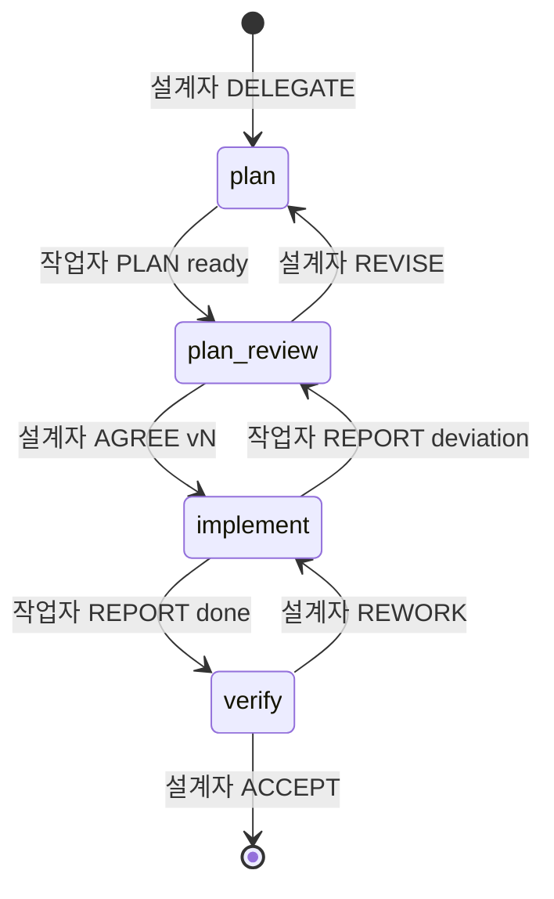

1. **plan**: 작업자는 파일을 읽기만 하고 계획 전문을 제출합니다. 요구 해석, 설계와 다른 점, `files` 코드블록(바꿀 파일 목록), 수용 기준, 테스트와 수용 기준의 대응, `test_command:` 한 줄, 열린 질문이 필수입니다. 이 단계에서도 읽기·검색 도구, 보조 에이전트, `ls`·`cat`·`grep`·`git log` 같은 읽기 명령은 쓸 수 있습니다.
2. **plan_review**: 설계자가 `AGREE vN` 또는 `REVISE 사유`로 답합니다. 파일 목록과 테스트 명령이 없는 계획은 합의할 수 없습니다. 라운드 한도(`plan_rounds`, 기본 3)를 넘으면 사람에게 묻습니다.
3. **implement**: 합의한 계획대로 구현합니다. 범위를 벗어나야 하면 새 계획과 `REPORT deviation`을 냅니다.
4. **verify**: 설계자가 합의된 테스트 명령을 직접 실행하고 계획 밖 변경을 검토해 `ACCEPT` 또는 `REWORK 사유`로 판단합니다.

계획서는 `docs/plans/<task-id>.md`에 버전별로 기록됩니다. `plan_approval: human`으로 두면 합의 후 사람의 최종 승인을 받습니다.

## 병렬 작업

서로 독립적인 일이 여럿이면 설계자가 턴 끝에 `duet-work` 블록을 내어 여러 세션에 동시에 맡깁니다.

````markdown
```duet-work
- id: api-login
  role: implementer
  task: 로그인 API와 테스트를 작성한다. 인터페이스는 docs/design/auth.md를 따른다.
  files: [src/api/login.py, tests/test_login.py]
- id: login-ui
  role: designer
  task: 로그인 화면 시안과 컴포넌트
  depends_on: [api-login]
```
````

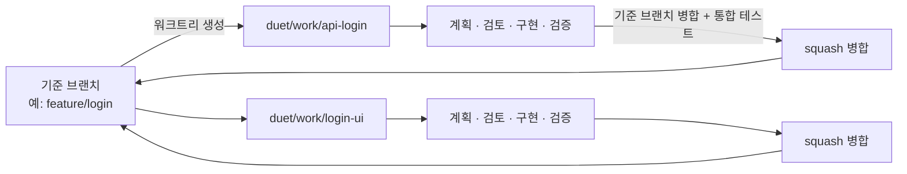

- **세션 수**: 역할별 `max_sessions`와 전체 `max_parallel`(기본 4) 안에서 설계자가 정합니다. 넘치는 작업은 차례를 기다립니다.
- **격리**: 작업마다 `.duet/worktrees/<id>` 워크트리와 로컬 전용 브랜치 `duet/work/<id>`를 만듭니다. 출발점은 duet을 시작할 때 체크아웃돼 있던 브랜치입니다. 원본의 `node_modules`, `.venv` 같은 의존성 폴더는 링크로 공유합니다.
- **설계자 분신**: 설계자 세션을 복제한 분신이 작업마다 붙어 계획 검토와 검증을 맡습니다. 설계자가 여러 세션과 동시에 협의하는 구조입니다.
- **세션 간 협의**: 작업자는 `CONSULT <작업id|architect> <질문>`으로 다른 작업 세션(읽기 전용 복제본)이나 설계자 분신에게 묻습니다.
- **병합**: 검증을 통과하면 duet이 작업 브랜치에 기준 브랜치의 최신 내용을 합칩니다. 충돌이 나면 작업자가 해결하고, 통합 테스트를 통과하면 기준 브랜치에 squash 병합한 뒤 워크트리와 작업 브랜치를 지웁니다. 병합 커밋 작성자는 git 설정의 사용자 본인입니다. `auto_merge: false`로 두면 병합 전에 사람에게 묻습니다.
- **push 금지**: duet은 원격에 아무것도 올리지 않습니다. `duet/work/*` push를 막는 pre-push 훅을 넣으며, 기존 pre-push 훅이 있으면 건드리지 않고 알려 줍니다. 작업이 끝나면 사람이 기준 브랜치만 push하면 됩니다. Bitbucket처럼 브랜치 생성이 제한된 환경에서도 배정받은 브랜치 하나만 쓰게 됩니다.
- **보고**: 한 차수의 작업이 모두 끝나거나 판단이 필요한 작업만 남으면 결과가 설계자에게 보고됩니다. 설계자는 `RESUME_WORK <id> [답]`, `CANCEL_WORK <id> <사유>`로 대기 작업을 처리합니다.
- **기록**: 작업별 대화는 `docs/work/<id>.md`, 상태는 `.duet/work.json`에 남습니다.

## 권한과 안전장치

모든 요청은 세 단계 중 하나로 분류됩니다.

| 단계 | 대상 예시 | 처리 |
| --- | --- | --- |
| 자동 허용 | 읽기·검색, 프로젝트 안 파일 수정, 테스트·린트·빌드 명령, 역할별 자동 허용 도구 | 바로 실행 |
| 설계자 판단 | 패키지 설치, 목록에 없는 명령, 웹 조회, 알 수 없는 도구 | 설계자의 심사 전용 세션이 허용·거부·사람에게 넘김을 결정 |
| 사람 확인 | `rm -rf`, `git push`, `git reset --hard`, `sudo`, `curl`·`ssh`, `.env`·키 파일, 프로젝트 밖 경로, 해석이 모호한 셸 구문 | 설계자 의견과 함께 승인 요청 |

- 명령은 따옴표와 셸 구문을 해석해 부분 명령마다 검사하며, 읽기 명령에 붙은 쓰기 옵션(`sed -i`, `sort -o` 등)과 파일 리다이렉트도 잡아냅니다.
- 규칙은 `.duet/policy.yaml`에서 고칩니다. 판정 기록은 `DIALOGUE.md`에 `> [approval] …`로 남습니다.
- Claude는 PreToolUse 훅과 권한 콜백으로, Codex는 턴별 샌드박스와 승인 요청으로, agy는 duet 전용 PreToolUse 훅으로 같은 정책을 적용합니다.

### 전권 자동 모드

전권 자동은 사람이 모든 권한을 위임한 상태로 끝까지 진행하는 기능입니다. 두 가지 방법으로 켭니다.

- **설정의 자동 수락 스위치**: 웹 UI 설정 화면 맨 위의 "전권 자동 수락"을 켜거나 `/autopilot on`을 입력합니다. 지금 쓰는 대화 모드(review, deliberate 등)는 그대로 두고 승인·선택만 자동으로 처리합니다.
- **autopilot 모드**: 모드 자체를 `autopilot`(턴 무제한, 스스로 결정하는 진행 방식)으로 바꿉니다. 웹 UI 상단의 모드 선택, `/mode autopilot`, `--mode autopilot`으로 켭니다.

켜져 있는 동안의 동작은 같습니다.

- 사람·설계자 확인이 필요하던 요청도 자동 허용합니다. 단 `policy.yaml`의 `autopilot_deny`(기본: `git push`, `sudo`, `/`·`~` 통째 삭제, `mkfs`·`dd`, 패키지 배포)는 막습니다.
- 턴 한도, 합의 라운드, 병합 확인 같은 선택은 진행 쪽으로 자동으로 고릅니다. 같은 질문이 다섯 번 넘게 반복되면 멈추고, 사람이 정한 예산 한도는 지킵니다.
- 작업자의 질문(`ASK_HUMAN`, `REPORT blocked`)은 설계자가 사람 대신 판단합니다. 설계자 자신의 질문만 사람에게 옵니다.
- 켜져 있는 동안 웹 UI 상단에 "전권 자동" 표시가 나타나며, 누르면 설정 화면으로 이동해 끌 수 있습니다.

## 대화 모드

| 모드 | 턴 한도 | 합의 흐름 | 특징 |
| --- | --- | --- | --- |
| sprint | 20 | 사용 안 함 | 설계는 짧게, 바로 위임하고 결과 위주로 진행 |
| review | 60 | 사용 | 구현 후 꼼꼼히 검토하고 재작업을 적극 요청 (기본) |
| deliberate | 무제한 | 사용 | 구현 전에 대안·반론·위험을 충분히 논의 |
| autopilot | 무제한 | 사용 | 전권 자동. 승인·선택을 사람에게 묻지 않음 |

- 턴 한도에 닿으면 10턴 더, 30턴 더, 무제한, 설계자가 정리하고 끝내기, 바로 멈추기 중에서 고릅니다.
- 무제한일 때도 정체(코드·문서 변경 없음), 핑퐁(변경을 서로 되돌림), 같은 작업 반복을 감지하면 멈추고 묻습니다.
- 모드는 `.duet/modes.yaml`에서 추가·수정할 수 있습니다(`max_turns`, `stall_turns`, `agreement`, `autonomy`).

## 긴 세션 관리

| 장치 | 설명 |
| --- | --- |
| 컨텍스트 한도 | 역할별 `context_limit`(설계자 50만, 작업자 30만 토큰, 기본 10만)을 넘으면 다음 턴 전에 압축 |
| 역할별 압축 지침 | 설계 결정·합의 계획·바꾼 파일 등 역할마다 보존할 내용을 지정해 CLI 고유 압축을 실행 |
| 작업 기억 | 에이전트가 매 턴 목표·결정·파일 지도를 요약하고, duet이 `.duet/memory/<역할>.md`에 저장 |
| 세션 교체 | 압축으로 부족하거나 입력 한도 오류가 나면 새 세션으로 바꾸고 작업 기억으로 인계 |
| 프롬프트 가드 | 한 턴 입력이 `prompt_max_chars`를 넘으면 초과분을 `.duet/reports/`로 빼고 경로만 전달 |
| 체크포인트 | 일정 턴마다 또는 `DIALOGUE.md`가 커지면 설계자가 요약하고 이전 대화를 `DIALOGUE-archive/`로 이동 |

## 세션 저장과 불러오기

- `/save 이름 -- 메모`로 저장하고 `/load 이름`으로 돌아옵니다. 웹 UI의 세션 화면에서도 할 수 있습니다.
- 저장본에는 `DIALOGUE.md`, 진행 상태, 역할 설정, 각 CLI의 세션 ID가 들어갑니다. 불러오면 그 시점의 CLI 세션을 복제해 이어가므로 원래 세션은 그대로 남습니다.
- 불러오기 전 현재 상태는 `_autosave-*`로 자동 저장되며 최근 5개를 유지합니다.
- 코드는 되돌리지 않습니다. 코드를 되돌리려면 `/rollback <턴번호>`로 그 턴의 git 스냅샷으로 돌아갑니다.
- 재시작하면서 복원하려면 `python3 duet --load 이름`, 목록만 보려면 `python3 duet --list-saves`를 씁니다.

## 명령어

웹 UI 입력창과 TUI 입력창에서 같은 명령을 씁니다. 일반 텍스트는 설계자에게 전달됩니다.

| 명령 | 동작 |
| --- | --- |
| `/to <역할> <메시지>` | 특정 역할에게 직접 전달 |
| `/mode [이름]` | 대화 모드 보기·변경 |
| `/turns <N\|inf>` | 이번 요청의 턴 한도 |
| `/auto on\|off` | off면 위임 전마다 확인 |
| `/autopilot on\|off` | 전권 자동 수락 켜기·끄기 |
| `/role list` | 역할 목록 |
| `/role add <이름> <claude\|codex\|agy> <모델> <설명>` | 역할 추가 |
| `/role edit <이름> <항목>=<값>` | cli, model, brief, permissions, effort, context_limit, max_sessions 변경 |
| `/role remove <이름>` | 역할 삭제 |
| `/work` | 병렬 작업 보드 보기 |
| `/work cancel <id> [사유]`, `/work resume <id>` | 병렬 작업 취소·재개 |
| `/work msg <id> <메시지>` | 병렬 작업 세션에 메시지 (다음 턴에 전달) |
| `/ask [역할]` | 새 터미널 창에 읽기 전용 질문 콘솔 열기 |
| `/memory [역할]` | 역할의 작업 기억 보기 |
| `/compact [역할]` | 다음 턴 전에 그 역할의 대화 압축 |
| `/pause`, `/resume`, `/stop` | 자동 진행 멈춤, 재개, 현재 턴 중단 |
| `/rollback <턴번호>` | 그 턴의 git 스냅샷으로 되돌리기 |
| `/save [이름] [--force] [-- 메모]` | 세션 저장 |
| `/saves`, `/load <이름>`, `/save-delete <이름>` | 저장본 목록, 불러오기, 삭제 |
| `/status`, `/plan`, `/help`, `/quit` | 상태, 현재 합의 계획, 도움말, 종료 |

## 명령행 옵션

| 옵션 | 설명 |
| --- | --- |
| `--doctor` | 환경 점검 (`--fix`, `--yes`, `--no-login`) |
| `--web` | 브라우저 웹 UI로 실행 |
| `--port <번호>` | 웹 UI 포트 (기본 8765, 사용 중이면 다음 번호) |
| `--host <주소>` | 웹 UI 주소 (기본 127.0.0.1) |
| `--no-browser` | 브라우저를 자동으로 열지 않음 |
| `--no-tui` | 단순 콘솔 모드 |
| `--mode <이름>` | 시작 모드 |
| `--max-turns <N\|inf>` | 요청당 턴 한도 |
| `--budget-usd <금액>`, `--max-hours <시간>` | 비용·시간 한도 (선택) |
| `-m "<메시지>"` | 시작하자마자 설계자에게 보낼 메시지 |
| `--new-session` | 저장된 에이전트 세션을 버리고 새로 시작 |
| `--load <이름>`, `--list-saves` | 저장본 불러오기, 목록 출력 |
| `--ask [역할]` | 질문 콘솔만 실행 |
| `--fake` | CLI 없이 가짜 에이전트로 흐름 시험 |
| `--no-venv` | 가상환경 자동 준비를 건너뜀 |

## 설정 파일

```text
duet/                      이 도구 (프로젝트에 복사)
.duet/roles.yaml           역할과 진행 설정 (main, roles, settings)
.duet/modes.yaml           대화 모드 프리셋
.duet/policy.yaml          권한 정책 (auto_commands, human_commands, protected_paths, autopilot_deny)
.duet/state.json           세션 ID, 턴 번호, 현재 모드, 진행 중 작업 (자동 관리)
.duet/work.json            병렬 작업 상태 (자동 관리)
.duet/models.json          CLI별 모델 목록 캐시
.duet/memory/<역할>.md      역할별 작업 기억
.duet/saves/<이름>/         저장한 세션
.duet/logs/*.jsonl         전체 이벤트 로그
.duet/worktrees/<id>/      병렬 작업 워크트리 (병합 후 삭제)
DIALOGUE.md                에이전트 공유 대화 문서
docs/plans/, docs/work/    합의 계획서, 병렬 작업 기록
```

주요 `settings` 항목(`.duet/roles.yaml`, 웹 UI 설정 화면에서도 변경 가능):

| 항목 | 기본값 | 설명 |
| --- | --- | --- |
| `max_parallel` | 4 | 병렬 작업 동시 세션 수 상한 |
| `auto_merge` | true | 검증과 통합 테스트 통과 시 자동 병합 |
| `integration_test` | 없음 | 병합 전 통합 테스트 명령 (없으면 작업별 test_command) |
| `work_test_timeout` | 900 | 병렬 작업 테스트 시간 한도(초) |
| `plan_rounds` | 3 | 계획 합의 라운드 한도 |
| `plan_approval` | architect | `human`이면 합의 후 사람 최종 승인 |
| `context_limit_tokens` | 100000 | 역할 기본 컨텍스트 한도 |
| `compact_floor_tokens` | 40000 | 작업 경계에서 미리 압축하는 기준 |
| `prompt_max_chars` | 20000 | 한 턴 프롬프트 최대 글자 수 |
| `dialogue_max_kb` | 120 | `DIALOGUE.md` 보관 기준 |
| `checkpoint_every` | 50 | 체크포인트 간격(턴, 0이면 끔) |
| `git_snapshots` | true | 턴마다 git 스냅샷 커밋 |

## CLI별 참고 사항

### Claude Code

- Claude Agent SDK로 설치된 `claude`를 실행합니다. 사용자·프로젝트 설정(`~/.claude`, `CLAUDE.md`, MCP, 스킬)을 그대로 불러옵니다.
- 상단의 비용은 API 요금 환산값입니다. 구독으로 로그인했다면 실제 청구가 아닙니다. 시작할 때 `ANTHROPIC_API_KEY`가 설정돼 있으면 경고합니다.

### Codex

- `codex app-server`(JSON-RPC)로 스레드를 열고 이어갑니다. `~/.codex/config.toml`, `AGENTS.md`, MCP 설정을 그대로 씁니다.
- 승인 정책은 `untrusted`이며, 신뢰 목록 밖 명령과 파일 변경만 duet 정책으로 넘어옵니다.

### Antigravity CLI (agy)

- `agy -p … --output-format stream-json` 헤드리스로 턴마다 실행하고 `--conversation`으로 대화를 이어갑니다.
- 헤드리스 agy는 훅의 "허용"을 무시하므로, duet은 agy를 권한 확인 없이 띄우고 작업 폴더의 `.agents/hooks.json` PreToolUse 훅이 duet 정책에 물어 거부할 것만 막습니다. 이 훅은 duet이 띄운 agy에서만 동작하고 직접 쓰는 agy에는 영향이 없습니다. 새로 만든 훅 파일은 `.git/info/exclude`로 커밋에서 뺍니다.
- 훅이 호출되지 않는 환경이면 경고를 띄우고 다음 턴부터 기본 권한 모드로 전환합니다.
- 모델은 `agy models`의 이름을 씁니다(예: `gemini-3.8-flash-medium`, effort가 이름에 포함).

## 문제 해결

| 증상 | 확인할 것 |
| --- | --- |
| 설치·실행이 안 됨 | `python3 duet --doctor`로 원인을 확인하고 `--fix`로 고칠 수 있는 것은 고치세요. |
| 의존성 설치 실패 | 네트워크·프록시를 확인하고 `.duet/venv`를 지운 뒤 다시 실행하세요. Debian·Ubuntu에서 venv 모듈이 없으면 `sudo apt install python3-venv` 또는 uv를 설치하세요. |
| `unrecognized arguments: --web` | 프로젝트 안의 `duet/` 폴더가 이전 버전입니다. 최신 코드로 교체하세요. |
| Claude가 API 오류(버전 미지원)를 냄 | 오래된 `claude`가 PATH에 먼저 잡혀 있을 수 있습니다. duet은 가장 최신 설치본을 고르지만, 시작 안내에 표시된 경로와 버전을 확인하세요. |
| 비용이 예상보다 큼 | 시작 안내의 계정 표시에서 구독인지 API 키 과금인지 확인하세요. |
| 병렬 작업이 시작되지 않음 | git 커밋이 하나 이상 있어야 하고, HEAD가 브랜치여야 하며(detached 불가), `git_snapshots`가 켜져 있어야 합니다. |
| 병합이 멈춤 | 메인 작업 트리가 기준 브랜치가 아니거나 병합할 파일에 커밋하지 않은 변경이 있으면 대기합니다. 작업 보드의 대기 사유를 확인하세요. |
| 디자이너 브라우저 도구가 안 뜸 | `npx`가 설치돼 있는지 확인하세요. 첫 실행 때 패키지를 내려받느라 시간이 걸립니다. |
| agy 권한 경고 | 시작 시 표시된 경고를 확인하고 `.agents/hooks.json`에 duet 훅이 있는지 보세요. |
| 상태를 자세히 보고 싶음 | `.duet/logs/<날짜>.jsonl`에 모든 이벤트가 남습니다. |

## 개발

```bash
# 프로젝트 루트에서
.duet/venv/bin/python -m pip install -r duet/requirements-dev.txt
.duet/venv/bin/python -m pytest -p no:cacheprovider duet/tests -q

# 의존성 고정 파일 갱신 (requirements.txt 를 바꾼 뒤)
cd duet && uv pip compile requirements.txt --universal --python-version 3.10 --no-header -o requirements.lock

# CLI 없이 전체 흐름 시험 (웹 UI)
python3 duet --web --fake
```

GitHub Actions(`.github/workflows/ci.yml`)가 push와 PR마다 Ubuntu·macOS, Python 3.10·3.12에서 테스트를 돌리고, 설치 스크립트와 첫 실행(가상환경 생성, lock 설치)을 검증합니다.

`--fake`는 가짜 에이전트로 위임, 합의, 승인, 병렬 작업, 병합 흐름을 그대로 재현합니다. 테스트는 실제 git 저장소를 임시로 만들어 워크트리·병합·push 차단까지 검증합니다.
